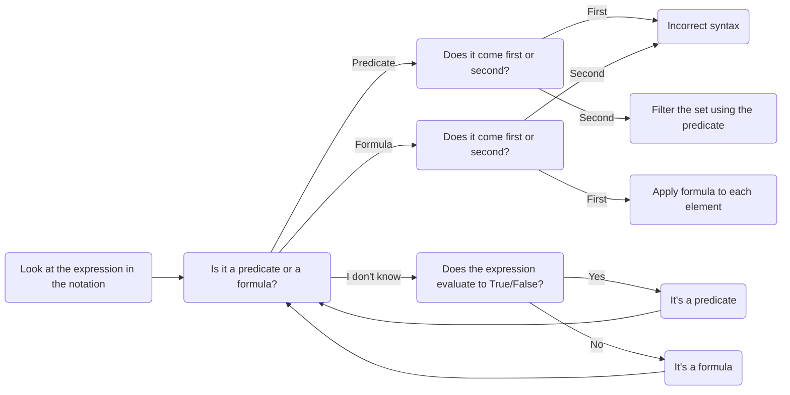

---
tags:
  - sets-functions
updated: 2025-04-14
aliases:
  - set-builder notation
  - set builder notation
---
---

#sets-functions 

## Definition 

> [!tldr] Definition
> **Set-builder notation** is a way of writing a [[Set|set]] where the set is defined by the rules that its elements must satisfy in order to be [[Set|elements]] of the set. Set-builder notation has two forms: 
> 
> - ("*Domain/filter*") The [[universal set]] from which elements are selected is given first, then a [[Predicate|predicate]] that filters out all but the elements of the set. 
> - ("*Formula/domain*") A formula is given first, then a [[universal set]] on which the formula is applied. 
>   
>   Examples of each form are below. 

Note: 
- A closely related Python concept is the [list comprehension](https://www.w3schools.com/python/python_lists_comprehension.asp), where a list is defined in terms of rules and formulas rather than explicitly listing the elements. For example the list `[0,3,6,9]` is generated from the list comprehension `[x for x in range(10) if x % 3 == 0]`. This is equivalent to the set, in set-builder notation, of $\{x \in \{0,1,2,\dots,9\} \, : \, 3 \ \text{divides} \ x\}$. 

## Examples 

- Domain/filter: The set $\{ x \in \mathbb{N} \, : \, x^2 < 100 \}$ takes the natural numbers as its [[universal set]] (or "domain") and filters out everything except those natural numbers whose square is less than 100. In [[roster notation]], this set is equal to $\{0,1,2,3,4,5,6,7,8,9\}$. This way of writing a set is helpful when you are selecting elements from a larger group using rules that can be expressed through predicates. 
- Domain/filter: The set $\{a \in \mathbb{Z} \, : \, |a| \leq 1 \}$ is the set $\{-1, 0, 1\}$. 
- Formula/domain: The set $\{x^2 \, : \, x \in \mathbb{N}\}$ takes the formula $x^2$ and "maps" it over the set of all natural numbers. The resulting set in [[roster notation]] is $\{0, 1, 4, 9, 16, 25, 36, 49, \dots \}$. This way of writing a set is helpful when the elements of the set can be easily expressed through mathematical computations or constructions. 
- Formula/domain: The set $\{(t, t+1) \, : \ t \in \mathbb{N}\}$ takes each natural number and creates a pair or "tuple" with the natural number in the first coordinate and the next natural number in the second coordinate. It is equal to the set $\{(0,1), (1,2), (2,3), (3,4), \dots \}$. 

Below are **incorrect** ways to use set-builder notation: 

- (*Putting a predicate first, then a domain*) Set builder notation with a predicate first does not make mathematical sense. For example: $\{x < 2 \, : \, x \in \mathbb{Z}\}$ is incorrect. 
- (*Putting a set first, then a formula*) Set builder notation with a formula *second* also does not make mathematical sense. For example, $\{x \in \mathbb{Z} \, : \, x+2\}$ is incorrect. 

The following flowchart can be used to determine whether the set builder notation is correct and how to convert it to roster notation. (Use the navigation tools to zoom in/out and pan around the flowchart.)

## Resources 

<iframe src="https://player.vimeo.com/video/602744516?badge=0&amp;autopause=0&amp;player_id=0&amp;app_id=58479" frameborder="0" allow="autoplay; fullscreen; picture-in-picture" style="position:absolute;top:0;left:0;width:100%;height:100%;" title="Screencast 3.2: Roster and set-builder notation"></iframe>

Other resources: 
- Video: [Set builder notation](https://www.youtube.com/watch?v=O84JrsT5r1o)
- Tutorial: [Set builder notation](https://www.cuemath.com/algebra/set-builder-notation/)

## Practice 

- [This tutorial has some interactive practice exercises at the end](https://www.mathgoodies.com/lessons/sets/set-builder-notation). 
- [General practice worksheet on sets that includes set-builder notation practice](https://www.cabrini.edu/globalassets/pdfs-website/math-resource-center/math-111-practice-test-chapter-2-answers.pdf). 